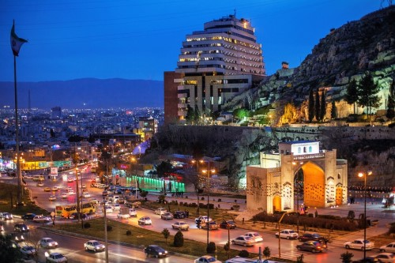
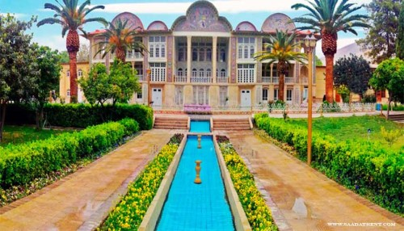

# mmehrjoo
Private repo for class work

# Mahmood Mehrjoo

## Where are you from?

I am from Shiraz-Iran. It is a city in south-central Iran, known for its literary history and many gardens. 

## IT Interest

When I was a kid, I really wanted to know how to build and create games or applications. Therefore, I followed up on this issue and got some information about that. it was fun. Then I took classes and learned more professionally. Right now I have some programming experience, such as design websites, Mobile App..

## First Computer

When I was a kid, I played video games. I remember SEGA and NINTENDO were the first consoles that I liked.

## Something Interesting About You

I sometimes hang out with my friends. I would like to taste different countries' dishes because Chicago is a city where people live in diverse cultures. In my spare time, I listen to music and watch Netflix and Hulu movies.